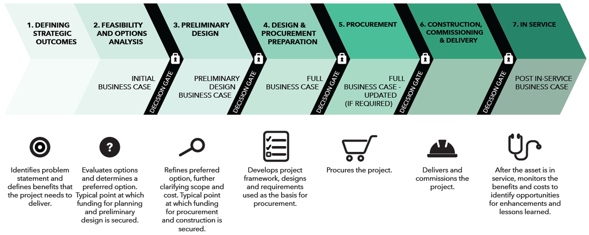

```{r setup, include=FALSE}
knitr::opts_chunk$set(echo = FALSE, message = FALSE)
library(devtools)
install_github("andrewheiss/reconPlots")
```

## Introduction

### Questions for You

1. Quantifying the costs and benefits of a project is important when planning it?
2. Projects can be consistently evaluated and ranked?
3. Project selection should be based only on quantifiable metrics?
4. All benefits can be quantified?

### The need for appraisal

- There is no shortage of promising ideas for transit
- Every year new infrastructure, services, and policies are proposed to expand and improve transit
- How can decision makers choose which investments to make?

## Business Cases as a tool for appraisal

### Business Cases

- A Business Case is a comprehensive collection of evidence and analysis that sets out the rationale for why an investment should be implemented to solve a problem or address an opportunity
- Business cases provide evidence to decision-makers, stakeholders, and the public as a crucial part of transparent and evidence-based decision making processes
- They are used throughout any proposed investment’s lifecycle, including planning, delivery, management, and performance monitoring

### Four cases of appraisal

#### Strategic Case

- Determines the strategic value of addressing a problem or opportunity with proposed options
- Options are evaluated against strategic objectives that link the problem/opportunity to regional goals and other - policies
- Determines the strategic value of addressing a problem or opportunity with proposed options

#### Economic Case

- Assesses the economic costs and benefits of the proposal to individuals and society as a whole, and spans the entire - period covered by the investment
- Uses standard economic analysis to detail benefits and costs in economic terms
- Establishes ‘what the benefit to society’ is in economic terms

#### Financial Case

- Assesses the affordability of the proposal, its funding arrangements and technical accounting issues and financial - value for money
- Focuses on capital and resource requirements, including taxation issues directly related to the intervention and - indirectly resulting from the intervention. The financial case is concerned with the impact upon budgetary totals.
- Establishes ‘how much the project will cost’ in financial terms

#### Deliverability and Operations Case

- Provides evidence on the overall viability of one or more options for addressing the problem/opportunity
- May consider procurement strategies, deliverability risks, operating plans and risks, or organizational risks
- Establishes ‘what is required to deliver and operate’ the project
- 
### Examples of business cases

- Metrolinx publishes many of its business cases at http://www.metrolinx.com/en/regionalplanning/projectevaluation/benefitscases/benefits_case_analyses.aspx

The four chapters

### Business cases used throughout the project lifecycle



::: notes

Initial Business Case

- Compares project options and selects a preferred option for further refinement and design.
- This business case is typically used to secure Provincial funding for planning and preliminary design.

Preliminary Design Business Case

- Takes the recommended option of the Initial Business Case and reviews different approaches to refine and optimize it, further clarifying scope and cost. 
- This business case is typically used to secure Provincial funding for procurement and construction.

Full Business Case

- Confirms a specific option (including benefits realization, financing, and delivery plans) for procurement.

Post-implementation Business Case

- Reviews the actual costs and performance of the investment after the asset has gone into service.
- This business case provides lessons learned and opportunities to enhance the service being provided.
:::

## Analytical principles

### Strategic analysis

### Economic analysis

### Financial analysis

### Deliverability and operations analysis


 https://www.andrewheiss.com/blog/2017/09/15/create-supply-and-demand-economics-curves-with-ggplot2/