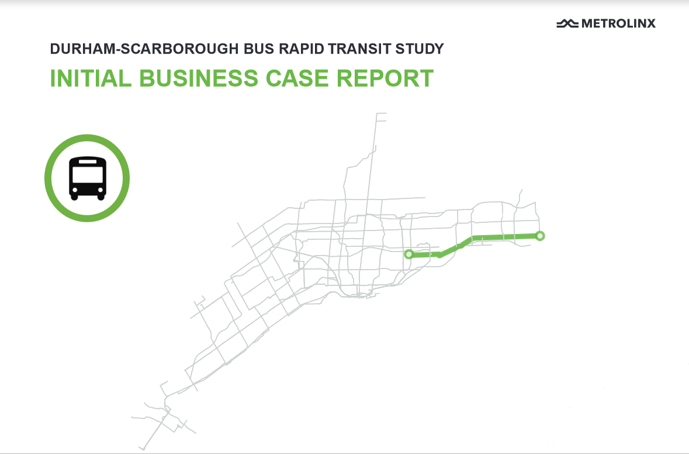

```{r setup, include=FALSE}
knitr::opts_chunk$set(echo = FALSE, message = FALSE)
library(devtools)
install_github("andrewheiss/reconPlots")
```

## Introduction

### Questions for You

1. Quantifying the costs and benefits of a project is important when planning it?
2. Projects can be consistently evaluated and ranked?
3. Project selection should be based only on quantifiable metrics?
4. All benefits can be quantified?

### The need for appraisal

- There is no shortage of promising ideas for transit
- Every year new infrastructure, services, and policies are proposed to expand and improve transit
- How can decision makers choose which investments to make?

## Business Cases as a tool for appraisal

### Business Cases

- A Business Case is a comprehensive collection of evidence and analysis that sets out the rationale for why an investment should be implemented to solve a problem or address an opportunity
- Business cases provide evidence to decision-makers, stakeholders, and the public as a crucial part of transparent and evidence-based decision making processes
- They are used throughout any proposed investment’s lifecycle, including planning, delivery, management, and performance monitoring

### Four cases of appraisal


::: notes

Strategic Case

- Determines the strategic value of addressing a problem or opportunity with proposed options
- Options are evaluated against strategic objectives that link the problem/opportunity to regional goals and other - policies
- Determines the strategic value of addressing a problem or opportunity with proposed options

Economic Case

- Assesses the economic costs and benefits of the proposal to individuals and society as a whole, and spans the entire - period covered by the investment
- Uses standard economic analysis to detail benefits and costs in economic terms
- Establishes ‘what the benefit to society’ is in economic terms

Financial Case

- Assesses the affordability of the proposal, its funding arrangements and technical accounting issues and financial - value for money
- Focuses on capital and resource requirements, including taxation issues directly related to the intervention and - indirectly resulting from the intervention. The financial case is concerned with the impact upon budgetary totals.
- Establishes ‘how much the project will cost’ in financial terms

Deliverability and Operations Case

- Provides evidence on the overall viability of one or more options for addressing the problem/opportunity
- May consider procurement strategies, deliverability risks, operating plans and risks, or organizational risks
- Establishes ‘what is required to deliver and operate’ the project

:::
 
### Business cases used throughout the project lifecycle


::: notes

Initial Business Case

- Compares project options and selects a preferred option for further refinement and design.
- This business case is typically used to secure Provincial funding for planning and preliminary design.

Preliminary Design Business Case

- Takes the recommended option of the Initial Business Case and reviews different approaches to refine and optimize it, further clarifying scope and cost. 
- This business case is typically used to secure Provincial funding for procurement and construction.

Full Business Case

- Confirms a specific option (including benefits realization, financing, and delivery plans) for procurement.

Post-implementation Business Case

- Reviews the actual costs and performance of the investment after the asset has gone into service.
- This business case provides lessons learned and opportunities to enhance the service being provided.
:::

### Examples of business cases


- Metrolinx publishes many of its business cases at http://www.metrolinx.com/en/regionalplanning/projectevaluation/benefitscases/benefits_case_analyses.aspx

## Concepts

### Problem or opportunity statement

A concise summary of the case for change being considered in the Business Case. It describes the central issues that should be addressed and, in most cases, should be 'investment agnostic'

Detailed assessment of the need for this project (Why are we doing this?) including why the status quo will not address this need.
What problem or opportunity does this proposal seeks to address?
Anticipated outcomes?
Objectives that would be solved?
Scope of the project?  
Interaction with or dependency on any other programs? 

Internal and external problem drivers (use images)

### Example Problem statement

:::::::::::::: {.columns}
::: {.column}

(http://www.metrolinx.com/en/regionalplanning/projectevaluation/benefitscases/benefits_case_analyses.aspx#durham)

:::
::: {.column}

The Highway 2 BRT corridor is a crucial transportation corridor connecting people through the Region of Durham and Scarborough. The corridor has varied traffic, land use conditions and constraints. With rapid growth in the past decade and an expectation for this growth to continue into the future, demand for travel along the corridor will continue to increase and a higher capacity form of transit will be needed to link communities and employment on both sides of the Toronto-Durham boundary.

:::
::::::::::::::

### Business As Usual

The baseline against which options are compared where the investment has not occurred and existing business practices, committed plans and general trends continue into the future

This should include:

- Funded and committed major changes to the transport network (example: a funded rapid transit line)
- Minor changes to the network (such as signal timing or frequencies on bus routes) added during model development based on changes to transport demand in future years
- Land use, population, and employment assumptions that are consistent with official plans/policies.

### Options

Poor Options Analysis:
A business case examining new locomotive procurement contains only one option for analysis:
Purchase10 new locomotives
No work is done examining purchasing different types of locomotives (used, refurbished) or the case for not purchasing said new locomotives

Sound Options Analysis:
Example: 2018 Durham-Scarborough Bus Rapid Transit IBC
An initial business case which examined three separate options
Examined differing technologies and routes to deliver the project
Option 1: Center Median bus lanes along the identified corridor
Option 2: Curbside bus lanes
Option 3: Hybrid alternative applying elements of options 1 and 2


### Base vs Real vs Nominal


### Discounting

Discounting is a process to convert benefits and costs that occur in future years into present value. The discounting process reflects people’s “time preference”, which is their widelyobserved preference for consumption today rather than in the future. People typically value $10 received today more highly than $10, received in the future. This is not only due to inflation, but due to a general, widespread preference in the population, the reasons for which are discussed below. Discounting is to be applied after prices have been adjusted to real terms.

Discounting estimates the present value of a stream of benefits and costs over the whole evaluation period. The present value is calculated by discounting each year’s benefits and costs, and then summing all the benefits in each year. This can be represented by the following formula, where the Σ symbol represents the sum over the evaluation period from year 0 to year n and the Π symbol represents the product of (1 + ri) over the range shown, in other words. This approach is summarized in Equation 5.1.

$$PV = \sum_{y=0}^n B_y / \prod_{i=base}^y(1+r_i)$$
`PV`: The Present Value
`B`: The Benefit or Cost (C) Under Analysis
`r`: Social Discount Rate

Or, use the `NPV` function in Excel

### Economic Case vs. Financial Case

- The Economic Case and Financial Case both present information in dollar terms, but reflect different ways to understand investment impact
- The Economic Case considers society-wide impacts and the resource costs to deliver an investment. In the Economic Case, impacts such as reducing user travel time, air pollution, or car accidents are monetized as benefits
- The Financial Case focuses on the financial resources required to implement the investment and the cash flow impact for the agency responsible for the investment
- Each case uses different assumptions and input parameters and care should be taken to differentiate the cases as the Business Case is completed

## Strategic analysis

RTP cover page image?

## Economic analysis

### Generalized Costs

The cost of taking a transit trip as perceived by travellers. Each mode or service in the GTHA has a cost composed of perceived travel times and direct user costs (fares or tolls), which determine if an individual will travel. Generalized Costs are used in transport demand models to allocate demand between the region’s services. Transport investments can change demand by changing the generalized cost of transport – either by providing a new service or modifying an existing one. When the generalized cost ‘paid’ by travellers decreases beyond what they were willing to pay, they benefit (example: a traveller was willing to use transit when the trip was 10 minutes - under an investment the trip is now 8 minutes, realizing a 2 minute benefit to the user.) If the generalized cost increases, users receive a disbenefit. Generalized cost changes are captured in the Economic Case as ’user impacts’.

### Social Costs

Each transport service has a social cost to society based on the impacts it creates. Common transport social costs include collisions resulting in property loss, injury, or death; emissions resulting in health impacts; and climate change. Investments may change the overall social costs of the transport system by reducing the overall social cost of travel in the GTHA (example: a new subway attracts demand from a highway, reducing greenhouse gas emissions).

### Rule of a half


### Consumer surplus

### Benefit Cost Ratio

The Benefit Cost Ratio (BCR) is calculated by dividing the present value of the total benefit by the present value of the total cost

$$ BCR = \frac{PVB}{PVC} $$

PVB : Present Value of Benefits – The real, discounted value of the stream of benefits

PVC : Present Value of Costs – The real, discounted value of the stream of costs

### Net Present Value

The Net Present Value (NPV) is the total present value of all future benefits minus the total present value of all future costs:

$$ NPV = PVB – PVC $$

The NPV is complementary to the BCR. It communicates value for money in an alternative way by showing overall the net benefit from the project in absolute terms. It is important to consider both the BCR and NPV in tandem when examining projects. It is common to focus on the BCR, but both are important. If a project's NPV is greater than 0, it is considered economically beneficial.

### Wider Economic Impacts

Add agglomeration image

Outline 3 types: competition, aglomeration, job matching

## Financial analysis

## Deliverability and operations analysis


 https://www.andrewheiss.com/blog/2017/09/15/create-supply-and-demand-economics-curves-with-ggplot2/